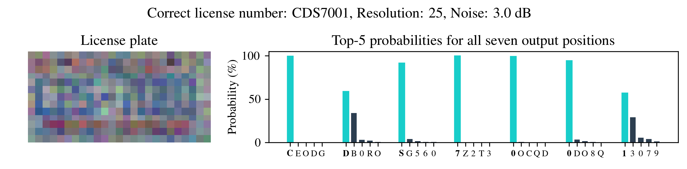
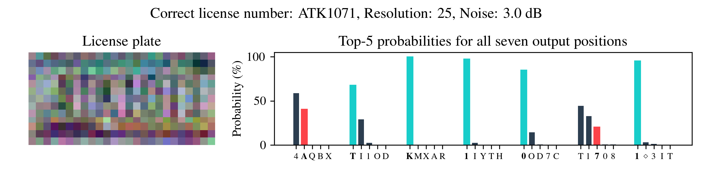
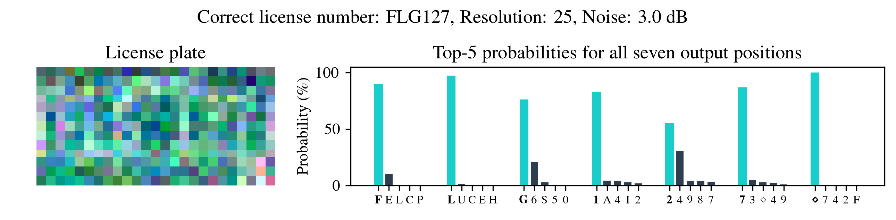

# Forensic Reconstruction of Severely Degraded License Plates

Code and pretrained *Real-world* CNN model for:

*Benedikt Lorch, Shruti Agarwal, Hany Farid. Forensic Reconstruction of Severely Degraded License Plates.
Media Watermarking, Security, and Forensics 2019, Burlingame, CA, USA, MWSF-529.* [bibtex](http://cris.fau.de/bibtex/publication/209464175.bib)

[Forensic Reconstruction of Severely Degraded License Plates - PDF](https://faui1-files.cs.fau.de/public/mmsec/license-plates/ei2019_forensic_reconstruction_of_severely_degraded_license_plates.pdf)

[Can you enhance it? - Forensic Reconstruction of Severely Degraded License Plates - Slides - PDF](https://faui1-files.cs.fau.de/public/mmsec/license-plates/ei2019_forensic_reconstruction_of_severely_degraded_license_plates_slides.pdf)


## Getting Started

Tested on MacOS 10.14 with Python 3.7, TensorFlow 2.1.0.


### Requirements
[Python 3](https://www.python.org/downloads/)

[LaTeX 3](https://www.latex-project.org/get/)

### Installation

Clone this repo.
```bash
git clone https://github.com/btlorch/license-plates.git
cd license-plates
```

Setup python virtual environmennt
```bash
python3 -m pip install --user --upgrade pip
python3 -m pip install --user virtualenv
python3 -m venv env
source env/bin/activate
```

Inside your virtual environment install required packages.
```bash
pip install -r requirements.txt
```

[Download trained model](https://faui1-files.cs.fau.de/public/mmsec/license-plates/license-plates-trained-model.zip) to `<repo>/model` or a directory of your choice.

[Alternate link to trained model](https://cs.iusb.edu/~csolovey/license-plates/license-plates-trained-model.zip)
```bash
wget https://faui1-files.cs.fau.de/public/mmsec/license-plates/license-plates-trained-model.zip
```

### File verification on trained model download
```bash
shasum -a 256 license-plates-trained-model.zip 
	ec2fad6f73e123e181780476b6e36b34228efde475fa1e053c45bd2a17234536  license-plates-trained-model.zip
```

### Unzip trained model to model directory
```bash
unzip license-plates-trained-model.zip -d model
```

### Running the demo
```bash
cd src
jupyter notebook
```

Then open `demo.ipynb`.

Depending on the location of the trained weights, you may need to update the path in the first cell.

### Examples






## CNN architecture

(View image to enlarge)


